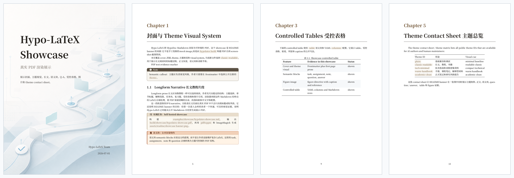

# HypoDoc

**把材料交给 AI，用 Markdown 写出文档和 Slides，再生成 PDF。**

适合中文技术文档、项目说明、复习资料、速查表和学术演示。源文件始终可编辑；不需要手工维护生成的 LaTeX。

以下介绍当前源码提供的功能；已发布安装包的能力以对应 Release 说明为准。用 `hypolatex --version` 查看安装版本。



## 让 AI 帮你完成

把仓库链接、材料和要求发给能够执行终端命令的 AI：

> 请使用 https://github.com/HypoxanthineOvO/HypoDoc 把下面的材料整理成中文文档或 Slides。先读 README，运行环境准备，涉及系统软件安装先征求我的确认。创建 Markdown，选择适合的主题，生成并检查 PDF，交付源文件和成品。材料如下：……

详细流程见 [AI 使用指南](Docs/ai-guide.md)。只能聊天、不能执行工具的 AI 可以协助写源文件，但不能代替本机构建。

## 第一次使用

需要 **Python 3.11+**。在仓库根目录运行准备脚本：

```sh
git clone https://github.com/HypoxanthineOvO/HypoDoc.git
cd HypoDoc
python3 scripts/setup.py
```

脚本准备独立 Python 环境和用户级 `hypolatex` 命令，检查 Pandoc / TeX；**不自动执行系统安装，不修改 shell 配置**。缺依赖时会告诉你怎么补齐。普通用户不需要 Node.js、Spec 子模块或实验仓库。

如果命令目录不在 PATH 中，可以重开终端或使用脚本打印的完整 CLI 路径。Windows 使用 `python scripts/setup.py`。系统安装、更新、卸载与平台说明见 [安装指南](Docs/installation.md)。

## 三条命令，得到第一份 Slides

```sh
hypolatex init slides.md --template slides --theme school
hypolatex doctor
hypolatex build slides.md
```

生成 `slides.pdf`。编辑 `slides.md` 后再次构建即可。

创建长文同样简单：

```sh
hypolatex init document.md --template document
hypolatex build document.md
```

需要指定位置时加 `--output build/result.pdf`；需要 TeX 时用 `hypolatex convert slides.md`。

## 选择样式与模板

| Slides 主题 | 特点 |
| --- | --- |
| `school` | 上海科技大学标识、完整章节导航与双层页脚；标准／斜切封面 |
| `simple` | 淡底、细线、克制的内容层级 |
| `nature` | 自然摄影封面、浅色几何正文背景、协调的彩色内容块 |

```yaml
---
title: 我的报告
profile: beamer
theme: school
school_cover: diagonal
---
```

`school_cover` 可选 `standard`、`diagonal`。主题与素材随包提供，普通构建不会联网克隆主题。

`init --template` 可选 `document`（长文）、`article`（项目／报告）、`slides`、`review`（复习题）、`cheatsheet`（速查表）。用 `hypolatex themes` 查看全部主题；常用写法见 [写作指南](Docs/authoring.md)。

## 不止是“编译成功”

- `hypolatex build slides.md --json`：机器可读的输出路径、溢出与字体提示。
- `hypolatex build slides.md --strict`：遇到溢出或缺字则失败，不替换已有 PDF。
- 字体优先使用熟悉的 Times / Consolas / Cascadia；缺少时使用 TeX 发行版的后备字体并明确提示。无需为构建安装商业字体。
- PDF 仍需检查内容和排版；日志不能覆盖所有绝对定位或图片中的问题。

## 查看与交付

交付 Markdown、实际素材和 PDF。Desktop / VS Code 用于查看；浏览器打印不等同于 LaTeX 导出。当前不输出可编辑 `.pptx` 或 `.docx`。

## 指南

[安装](Docs/installation.md) · [AI 使用](Docs/ai-guide.md) · [写作](Docs/authoring.md) · [开发](Docs/development.md) · [测试](Docs/testing.md) · [发布](Docs/releasing.md)

第一方代码使用 [MIT](LICENSE)。第三方主题、摄影素材与学校标识保留各自条款，见 [资源说明](Renderers/LaTeX/src/hypolatex/resources/slides/NOTICE.md)；学校样式不表示学校背书。依赖许可见 [清单](reports/third-party-licenses.md)。
