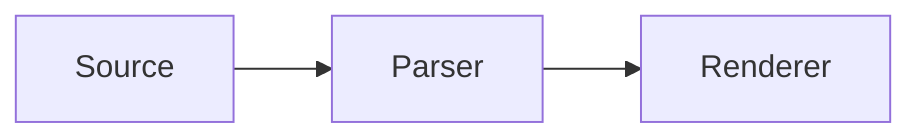

# Reference Oracle

## Portable Runtime

### First Frame

- [ ] Preserve task-list state.
- [x] Keep source order.

Inline math uses $E = mc^2$.

$$
\int_0^1 x^2\,dx = \frac{1}{3}
$$



```typescript
const marker = "::: {.warning}";
```

::: {.note title="Reference boundary"}
Pandoc is the development oracle, not the product runtime.
:::

::::: {.qa #probe-choice kind="single-choice"}
::: {.question}
Which runtime ships in the product?
:::

:::: {.choices}
::: {.choice #portable-runtime}
The portable implementation.
:::
::::

::: {.answer choices="portable-runtime"}
The reference toolchain remains in development and CI.
:::
:::::

---

### Second Frame

The thematic break is also a slide-frame boundary under the `beamer` profile.
